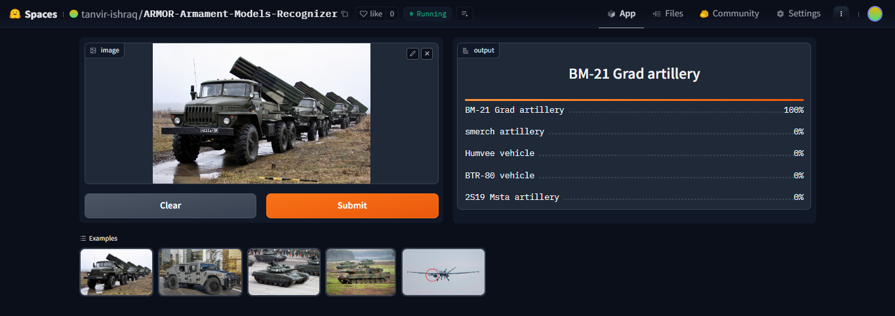

# Project A.R.M.O.R Introduction
"A.R.M.O.R - <strong>Ar</strong>mament <strong>Mo</strong>dels <strong>R</strong>ecognizer for civilian security."
 
A comprehensive image classification model from data collection, dataset cleaning, model training, full deployment and API integration.  
  
The model was developed as a security measure that can classify comprehensive 22 different types of most common military armaments posing threat for civilians on land and overall civilian security.  
* I carried out comprehensive research on the most typical armaments category.   
* I researched the most produced and available armaments in modern times.  
* I researched the most used armaments in military activities and conflicts in modern times.  
* I researched the most accessible and obtainable armaments in modern times.     
The armament types are following:  
1.  2S19 Msta artillery
2.  BM-21 Grad artillery
3.  G6 Rhino artillery
4.  M109 artillery
5.  M270 MLRS artillery
6.  Smerch artillery
7.  BMP-2 vehicle
8.  BTR-80 vehicle
9.  Humvee vehicle
10. LAV-25 vehicle
11. M113 vehicle
12. MRAP vehicle
13. Leopard 2 tank
14. M1 Abrams tank
15. T-72 tank
16. Type 99 tank
17. Bayraktar TB2 UCAV drone
18. CH-5 Rainbow UCAV drone
19. Hermes 900 drone
20. Heron TP drone
21. MQ-9 Reaper UCAV drone
22. RQ-4 Global Hawk UCAV drone

Tank and artillery shock the opposition while staying robust and afar without taking damage. Unmanned drones are highly used because they can inflict damage without risking pilots, replacing combat planes. Other vehicles are used to support actual infantry engagement. All of these pose a threat to civilians. This covers mass amount of armaments of countries and conflicts worldwide such as Yemen, Syria, United States, Iraq, Iran, Ukraine, India, Germany, China, Russia, Turkey.    

# Dataset Preparation
**Research:** Existing military datasets are not tailored towards civilian security focused at all. They also doesn't widely armaments and information regarding modern times and conflicts.  We aim to update them for our modern goals. I did research on which categories poses most threat to civilians being on land. Did deep research on most common armaments on each categories. researched most produced available armaments in modern times. researched most used in military operation and wars in modern times. researched most used armaments.   
**Data Collection:** Downloaded from DuckDuckGo using term name. A grand total of ~5500 images finally consisted our dataset after deeply cleaning dataset. (with more data and categories to be added more later project version)   
**DataLoader:** Used fastai DataBlock API to set up the DataLoader. Proper dataset split percentage was followed. Proper batch_size was set to utilize power of GPU.  
**Data Augmentation:** fastai provides default data augmentation which operates in GPU.  
Details can be found in `data augmentation` section in `notebooks/ARMOR_classfier_full_process.ipynb`

# Training and Data Cleaning
**Training overview:** The powerful ResNet-152 model was chosen as starting point. I fine-tuned the ResNet-152 model for 20 epochs and achieved up to ~97% accuracy. During this 20 epochs period, I observed train loss and validation loss with attention to ensure overfit doesn't occur.   

   

**Data Cleaning:** This was the most time-consuming part. I dealt with a lot of noisy data/miscategorization from the browser fetched images. There were also images that interfered. And some images were contaminated. First I did an universal cleaning manually. Then I cleaned and updated data using fastai `ImageClassifierCleaner`. I cleaned the data each time after training or finetuning, except for the last time which was the final iteration of the model.  

   

# Model Deployment
I deployed the model to HuggingFace Spaces Gradio App. The implementation can be found in `hf_deployment` folder and [online here](https://huggingface.co/spaces/tanvir-ishraq/ARMOR-Armament-Models-Recognizer).  

# API integration with GitHub Pages
The deployed model API is integrated [here](https://tanvir-ishraq.github.io/A.R.M.O.R-Armament-Models-Recognizer/) in GitHub Pages Website. Deployment implementation and other details can be found in `docs` folder.
